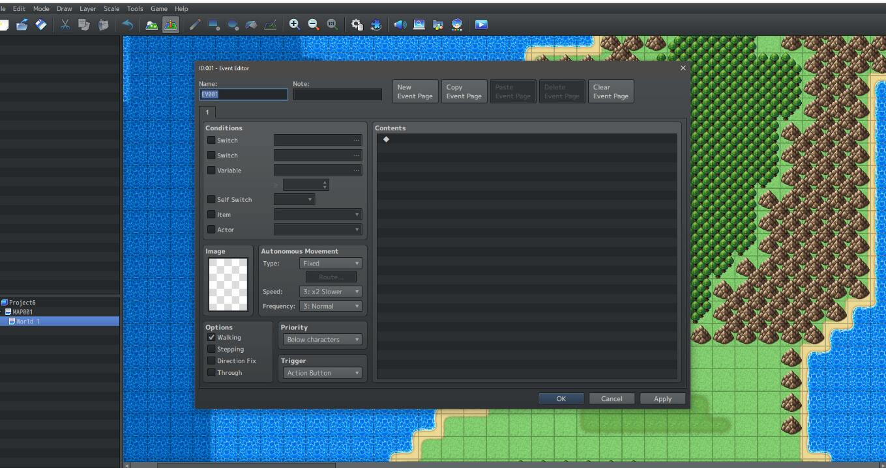
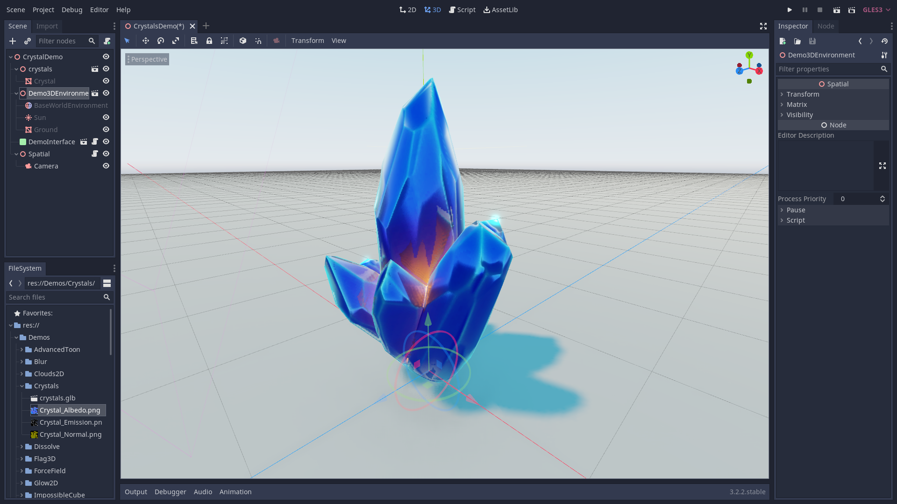

+++
title = "Game Engine Basics"

description = "What are game engines and what are the important factors to consider when browsing for game engines on the market."
author = "razvan"

date = 2020-08-15T21:52:08+03:00
weight = 5
draft = true
+++

In this guide, we break down how game engines work through the lens of a top-level overview.

Througout this article we'll use mostly Godot screenshots to demonstrate specific mechanics in game engines since it's the primary tool we use here at GDQuest.

By the end of this article you'll know about:

- What game engines do.
- How to choose the right game engine.

## What's a game engine?

A game engine is a full-featured application or framework for creating games. Their purpose is to make game developers' life easier by automating repetitive tasks that appear in most game projects, like drawing images on the screen or playing audio.

These days, we take for granted that an engine should manage:

- User input
- Animation
- Audio
- Navigation
- Internationalization
- Graphical User Interfaces
- Networking
- Rendering
- Particle systems and visual effects
- Physics simulation
- Profiling and debugging
- Compile and exporting projects on multiple platforms

And more. These expectations came with the growth of general game engines like Unreal or Unity. A general engine allows you to create many types of games. There are dozens of them available for free today.

On the other hand, specialized engines are created and optimized for one game or one type of game. RPG Maker, a program designed to create 2D Japanese RPGs, is a well-known example. Popular indie games like Super Meat Boy or Northgard also run on dedicated engines.

Game engines come in many flavors. Some offer a complete editor while others only provide code that you build from.

Editors allow you to create game levels visually. You import assets like images, 3D models, or audio files and place them in the editor's viewport. The actual engine is the code that takes all these levels and runs your game.

Some game engines come with a complete editor: Unreal, Unity, Godot, Game Maker, Construct. Others like Panda3D or Phaser only provide code. This isn't to say that one type is better than the other. Every development team has different needs, and they should assess the tools they use on a per-project basis.

### Pros and cons

Using a game engine has advantages and disadvantages.

Some pros are that:

- You can focus on game content rather than technicalities.
- You don't have to learn to build everything from the ground up, like drawing pixels on the screen or playing audio.
- With an editor, it's easier for non-coders to participate in the development process.
- Engines can provide a plugin <abbr title="Application Programming Interface">API</abbr> for third-parties to integrate their tools and make them available to others. You can find many specialized editors for different types of games on Unity's asset store, for example.

Here are some cons:

- It's harder to control performances since you rely on complex software written by someone else. In the case of open-source projects, even though you have access to the code, the codebase can be too complicated to adapt it to your needs.
- You have to adapt to the engine's workflow and the way it works.
- You also have to work with its quirks and weaknesses.

Of course, these depend a lot on your current skills. If you have no programming experience, creating an engine might not even be an option. You'll want to [learn to code]() first and maybe gain some experience coding small programs and games to get your wet first.

## How does a game engine work?

A game engine is built out of many complex parts or modules. Each with its own specialized function. Some of the more obvious ones are:

- Audio engine
- Physics engine
- Graphical User Interfaces
- Rendering
- Animation
- Networking
- AI

Apart from the modules themselves, game engines have managers that organize the interaction between these different parts. Most modern game engines run some of these modules in parallel in order to improve performance. Parallel execution increases code complexity substantially, not to mention the complexities that comes with the visual rendering pipeline for the video card. For this reason and many more, most game developers, be it hobbyists and all the way to seniors, opt for available game engines on the market instead of creating everything from scratch.

Most of these tools allow you to inject custom functionality by means of a scripting programming language through the use of built-in components. So you can bring in third party assets and resources from different places such as 3D modelling applications, audio-creation tools, image editors, fonts from the internet, and much more that you can then organize, operate on, and customize to fit your game's needs.

Most general game engines today offer more than just operating on and organizing these resources though. Through a plug-in architecture they allow you to even customize the game engine editor itself, leading to highly opinionated workflows. With modern video card technology some even allow you to customize the way things are rendered on the screen, by tapping into the video rendering pipeline.

This just scratches the surface. There's lots more to talk about, advanced topics that we can't cover in a general article like this one.

One very important aspect of game engines is a project manager that helps you exporting games for your target platforms, such as Windows, Linux, MacOS, Android, iOS, and consoles. We can't underestimate the importance of having an exports manager as there are many complexities that come with cross-platform support.

Here at GDQuest we have specialized in Godot and if you want to learn more about it we have free tutorials and payed courses.

## Can I make my dream game now?

Making games isn't an easy task, but answering this question is a bit more complicated. You have instances of highly popular simple games like Flappy Birds, but these are mostly exceptions. Even with these you need to have an understanding about programming, visual design and audio at the very least.

One of the first questions to answer is how to choose a game engine. If you're a beginner or hobbyist starting out, browsing for game engines is relatively simple because you can just go for what's easy to find and free. Some of the more important aspects in choosing an engine, apart from it being free, is user-friendliness, documentation and community support rather than high performance. These are the first hurdles you may face at the very beginning and regardless of the tool you pick, you'll have to learn the basics of game development, skills that are transferable and can be applied to any tool.

With that in mind, instead of getting hung up on the decision, we recommend looking into the Godot game engine among your picks. We have many free [beginner-friendly tutorials and demos]() for it as well as [payed courses](https://gdquest.mavenseed.com/p/home) to help you get beyond the initial steps.

Godot is a full-feature beginner-friendly general game engine, packed in a very small executable, capable of making both 2D and 3D games. It's well worth exploring what it has to offer.

