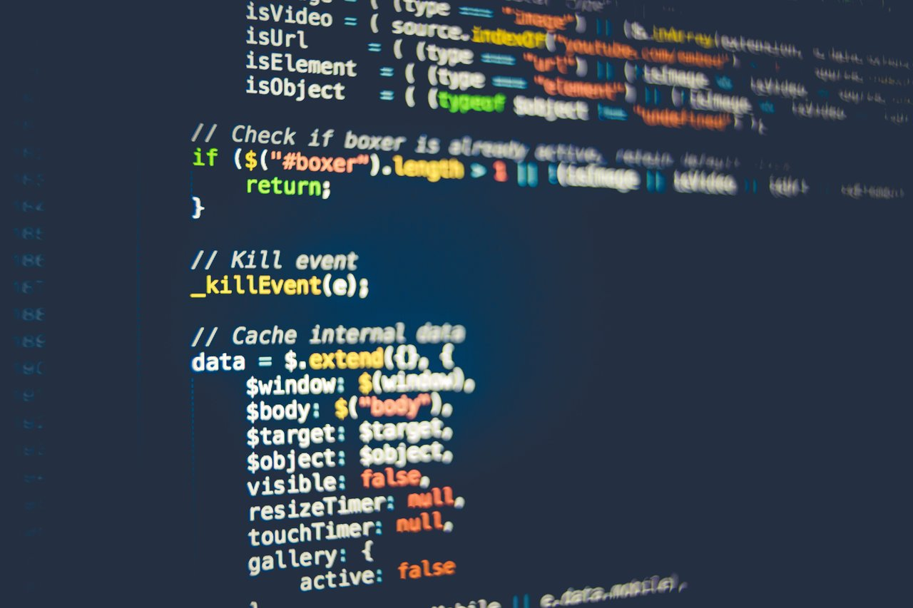

+++
title = "Choosing a game engine"

description = "What do you have to think about when choosing the right game engine for you."
author = "razvan"

date = 2020-08-18T18:25:08+03:00
weight = 3
draft = true
+++

In this article we'll look at a few questions raised when browsing for game engines on the market.

If you're just starting out you may be interested in our [other article]() covering the basics of game engines in general.

## How to choose a game engine. For developers

When it comes to picking a game engine, but more generally any tool, it isn't usually a clear cut answer. You have to weigh the pros and cons on a case-by-case basis. One framework that works for you might not work for us.

With that in mind, we'll go over a few aspects to consider when browsing for a game engine.

### Closed VS open source and philosophy

We live in an era when **closed source and open source** both coexist. And it isn't exactly easy to pick one over the other. With **closed source** you get the benefit of having a highly professional dedicated team working on bug fixes and support. Some mainstream **open source** projects are getting there, but they're not yet on par with **closed source** development.

On the other hand, when it comes to close source VS open source it can also become a philosophical matter. If you have the luxury to starting fresh or you're just at the beginning of the journey, open source can be a viable pick if you're interested in furthering this cause and mindset. If you're in a position of just having to get a product out and bring in the money to sustain a business then close source is possibly more suitable as it's usually a more polished product.

Closed source projects have one downside that open source don't. And that's fees and the license. This is mostly relevant for hobbyists and people starting out rather than businesses. Businesses are willing to pay in order to get their product as fast as possible on the market.

One downside of closed source projects is that the tool might get deemed unmaintainable by the development team and they might drop support for it entirely, forcing teams to buy a new tool. There's no guarantee that the new game engine will be compatible with older versions.

### Documentation, support, and community

A huge role is played by the maturity of **documentation, available training material and support** from the game engine development team and its **community**. It cannot be underrated how important documentation and education is.

Here again, closed source projects take the edge usually as these companies have a product to sell and they want you to be happy with your experience using their product. Open source projects usually lack behind when it comes to documentation because most people want to contribute to code. Lately they are catching up to the closed source model so unless we're talking about fringe open source projects, most of them do a decent job at documenting their product.

Community is an important factor because there's a lot of educational material stemming from it. Having an friendly community is also important because often you have corner cases with these tools and you need a quick tip to get you moving forward.

### Game editor and customizability

We have two type of products when it comes to game engines. Products that come with a **visual editor** and software development kits (SDKs) that provide only the code.

A visual editor is much simpler to use, especially for non-programmers and artists. It makes a compelling reason to choose such a product. But let's not diminish the importance of SDKs as an alternative. For an experienced developer, an SDK might just be the perfect tool. There are a lot of factors to consider when it comes to this topic, but it's safe to say that most teams these days, opt for game engines that come with visual editors.

The game editor is tightly constrained by the design choices and architecture philosophy of the game engine developers. This has a huge impact on your workflow and it might be a deciding factor when it comes to picking a game engine. Because, in the long run, the tool choice to begin with, will dictate how you'll develop as a team or individual.

These days, most game engines with editors, come packed with features, including ways to **customize** the editor itself. This is a powerful feature as it allows you to modify the editor and adapt it to your needs and workflow. This cannot be underestimated for complex projects.

### Available scripting languages

Depending on your background, **scripting language** availability might turn out to be a big factor. Not everyone is willing to learn a new language from scratch.

Artists and non-coders might prefer visual scripting languages. It's up to you and your team to work out the benefits of having a game engine with this option. Most mainstream game engine these days do come with visual scripting languages so it might not be a huge factor to consider.

On the other hand there are a few engines that come with their own scripting languages and this might put a bit of strain on the programmers as they'll have to learn a new language. Often times this isn't a huge obstacle, but it can be a nuisance and it can take some time.

### Performance

These can be important factors, but not as important as some people think. Most devices these days are good enough to run even unoptimized projects.

You can start thinking about these factors once you get to a point where you create complex games such that every frame needs the best performance it can have. Or in case you target low-end devices.

In most cases, beginner-friendliness and ease of use trumps high performance.

### Conclusion

These are a few of the things to consider when researching game engines and the right tool for your needs. Game engines can be so much more than simple tools you choose for specific tasks and projects. They can literally dictate how you grow as a team or individual in your pursuit for game development.

If you want to get started with Godot, this is the right place. We have huge amounts of [free educational resources]() as well as [payed courses](https://gdquest.mavenseed.com) to help you go beyond the basics. These days, started on 15 August, you can also support us through [our latest kickstarter](https://www.kickstarter.com/projects/gdquest/godot-2d-secrets-level-up-your-game-creation-skills) - Godot 2D Secrets: Level Up your Game Creation Skills.
