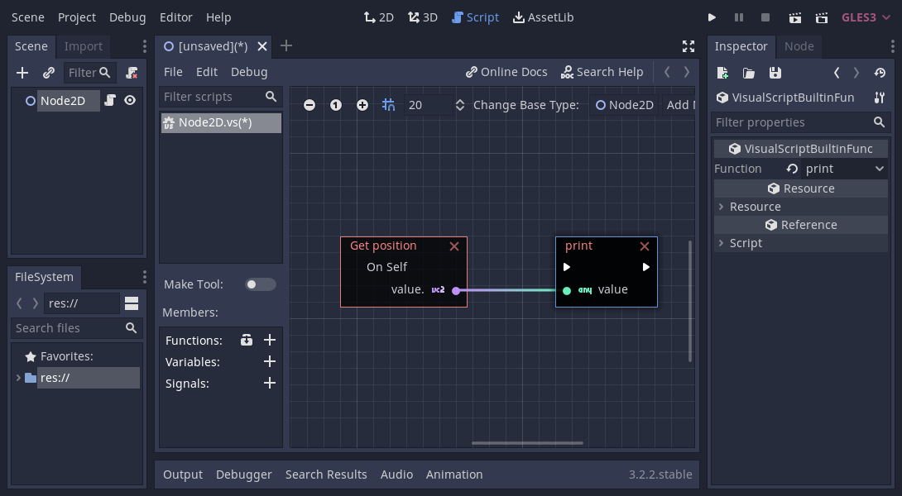

+++
title = "Game Engine Basics"
menuTitle = "Game Engine Basics"

description = "What are game engines and what are the important factors to consider when browsing for game engines on the market."
author = "razvan"

date = 2020-08-15T21:52:08+03:00
weight = 5
draft = true

difficulty = "beginner"
keywords = ["tutorial"]
+++

Learning a complex software tool like a game engine can be overwhelming for beginners. In this tutorial we'll break down how a game engine works, from a programmer point of view, in the context of [Godot](https://godotengine.org) and GDScript.

We'll learn about:

- What a game engine is and specifically about the Godot game engine
- GDScript basics: input handling and real-time processing
- What are signals and how to coordinate function calls with them

## What is a game engine

A game engine is a full-featured software tool for making games. Put very simply that is what a game engine is.

The purpose of a game engine is to make game developers' life easier by automating repetitive tasks that appear in most game projects. This comes with advantages and disadvantages.

The advantages are that:

- We don't have to build everything from ground up facilitating fast prototyping and building a workflow pipeline.
- Tool makers integrate their software with existing game engines making it easier to use their assets.
- Developers can focus on game content rather than technicalities.
- Makes it easier for non-coders to participate in the game development process.

On the other hand, disadvantages include:

- It's harder to control performance since we rely on very complex code built and maintained by a third party. In case of open source projects, even though we have access to the code, the architecture in most cases is too complicated to directly modify and improve.
- Workflows can become highly specialized making it difficult to integrate or expand with other software tools.

Game engines come in many flavors, some offer game editors as well, while others come packaged as SDKs (Software Development Kits) offering only the code base to build upon.

The game editor allows us to visually create our game from different assets (images, 3D models, audio files etc.) while the engine is the framework that allows us to run our games.

A game engine that comes with a full-featured editor is Godot, while [Panda3D](https://www.panda3d.org) is just an SDK (Software Development Kit) without an editor. This isn't to say that one is better than the other. Every team and person has different needs and these tools have to be assessed case-by-case.

These days we take for granted what a game engine has to offer:

- User input handling
- Animation
- Audio
- Navigation
- Internationalization
- GUI (Graphics User Interfaces)
- Networking
- Rendering
- Particle system
- Physics simulations
- Profiling and debugging
- Compile and run projects on multiple platforms
- AI functionality

And many more features. Later we'll dive into the specifics of the Godot game engine, a tool we use here at GDQuest.

### The game loop

So how does a game engine work? The primary concept of a game engine is **the game main loop**. We can think of the game loop as the heart of the game engine. It's what makes it tick.

Among the many systems that build up a game engine, we have an animation system and a physics simulation system. The physics engine is built such that it runs at 60 frames per second, while the animation system isn't required to keep a fixed frame rate because it's a visual feedback, in most cases decoupled from the physics simulation so to improve the physics performance.

This means that some of these tasks are separated in threads, some running in parallel. For example some of the common tasks are:

- idle frames (for animation decoupled from physics simulations)
- physics frames (for physics simulations)
- user input (such as button presses, mouse movement, joystick action etc.)

All of this functionality is managed through the main game loop which is the main game engine system manager.

## How to choose a game engine

When it comes to picking a tool, usually it isn't a clear cut answer. We have to weigh the pros and cons on a case-by-case basis. One framework that works for you might not work for us. With that in mind here's a list to consider when browsing for a game engine:

- Closed source VS open source: this can become a complex matter, it can be philosophical on one hand as well depending on your personal feeling towards an open source software as opposed to a closed source package. On the practical side, an open source tool gives us the ability to customize the code for our particular needs. Closed source also means that the company might, for whatever reason, drop support and availability for the tool version you require.
- License, royalties and fees: sometimes overlooked, license can play a big role in choosing a tool. It can start free for indie developers for example and after a successful start you might be required to pay fees that you haven't initially considered.
- Documentation and support: this is a huge important factor to consider. An undocumented complex tool with is almost useless so good official docs are a must.
- Editor: a GUI editor is much simpler to use than to code everything, although, as mentioned before, it can be a subjective matter. It's something to consider.
- Available scripting languages: depending on your background, scripting language availability might turn out to be a big factor. Not everyone is willing to learn a new language from scratch. On the other hand, artists and non-coders might want prefer visual scripting languages.
- Customizability: this is different from being an open source project which can be customized at the low level. Most game engines these days have a plug-in system in place that allows extensibility and customization of the workflow. It's one factor to consider.
- Performance, storage and run-time memory: these can be important factors, but not as important as some people might think. Most devices these days are good enough to run even unoptimized projects on them. We start thinking about these factors once we get to a point where we create complex games such that every frame we need the best performance, or if we target low-end platforms.
- OS cross-compilation: supported platforms is a major factor to consider since this might limit our availability on the market place.
- Support for assets types: importing assets from external tools is very important as not everything can and is done through the game engine framework itself.
- Community: having a community available can help us get unstuck on specific issues we might encounter. Not everything is covered by the official documents and having a strong community to rely on can save us a lot of grief and time spent debugging.
- Tool design philosophy and architecture: this can cover a wide spectrum of concerns, going from object oriented programming concepts all the way to functional programming concepts and beyond. Design philosophy of the tool can influence our workflow greatly so it's a factor to consider.
- Tool development cycle: how fast a tool releases updates, fixes, new version is something to consider. It's a sign of people being interested in the tool and the activity behind the management.
- Up-to-date tech: especially with game development, being up to speed with the latest tech and research is almost a requirement these days. Depending on our project needs we might require state-of-the art functionality or just an available framework that uses the latest developments in performance improvement and visual presentation.

These are a few of the things to consider when researching game engines and the right tool for our needs. Game engines can be so much more than simple tools we choose for specific tasks and projects. They can literally dictate how we grow as a team or individual in our pursuit for game development.

In the next part we'll look at a few highlights from the Godot game engine.

## The Godot game engine

Godot is an open source game engine and the tool we use here at GDQuest. It comes with an impressive list of features, packed in a tiny executable package. The software includes a game editor and lots of built-in classes to simplify the game building process.

One of Godot's main design goals is to be user-friendly, having a very low entry bar which means that artists and non-coders can learn to make games with it just as much as anyone else.

Its main coding language is called GDScript, an in-house built scripting language highly influenced by Python, but far more simpler. Being derived from Python means that it's very close to the English spoken language which is one reason why it can be learned very quickly. Among other things, Godot also comes with a visual script editor which means that we can code visually, connecting nodes together. For advanced users, Godot also officially supports C# as an alternative scripting language.

In Godot, we have a class called [`MainLoop`](https://docs.godotengine.org/en/stable/classes/class_mainloop.html#class-mainloop) which is this game engine's main game loop. It can be customized with our own code if required, although in practice this is very situational.

The default `MainLoop` implementation is provided by the [`SceneTree`](https://docs.godotengine.org/en/stable/classes/class_scenetree.html#class-scenetree) class. It manages a tree hierarchy of nodes that together create a scene tree. To learn more about the `SceneTree` and Godot's particular implementation of the main loop check out the [`SceneTree` tutorial](https://docs.godotengine.org/en/stable/getting_started/step_by_step/scene_tree.html) in the official docs.

The image above shows a scene tree structure made with built-in nodes, from one of our demo projects. This is a core architecture design of Godot.

All of these features and design decisions that go into creating a game engine come into play when deciding on which package to choose for our own projects. For us, Godot is our main pick as one of the fastest growing open source game engines available.

Perhaps it can be for you too.

<!--TODO: highlight features - networking, multiplayer, etc.-->
